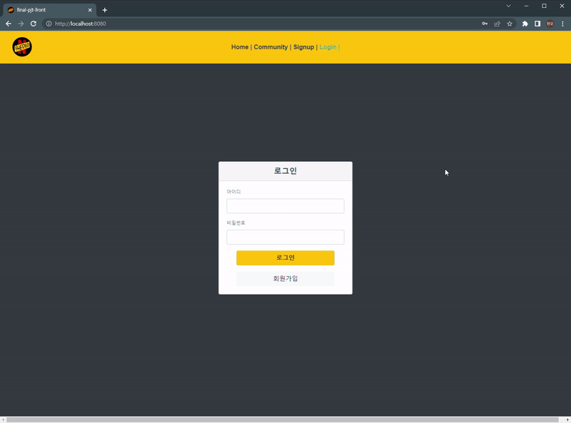
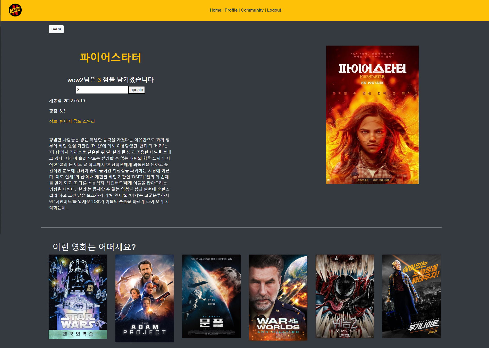
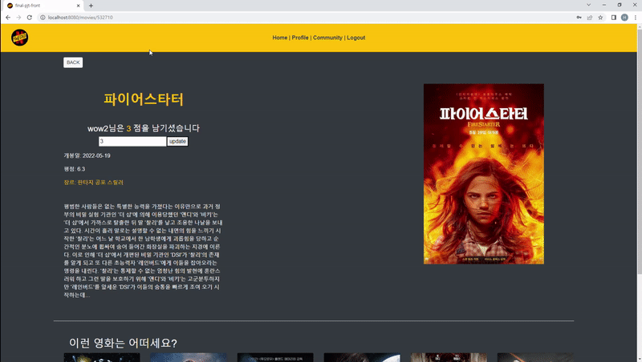
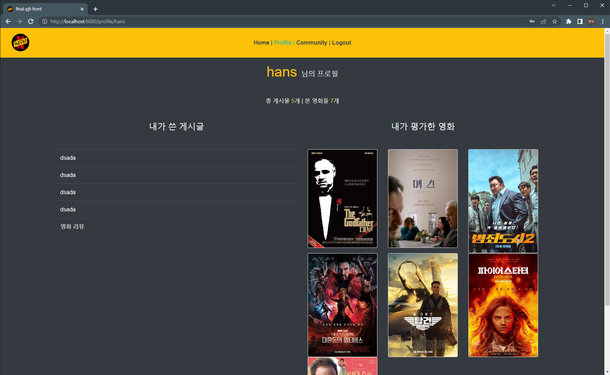
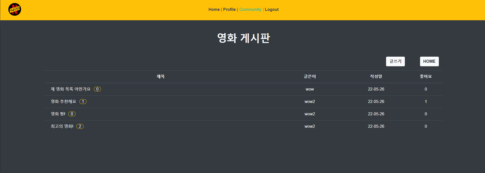
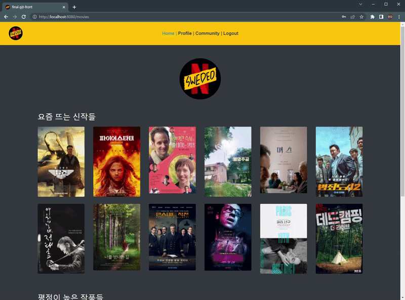
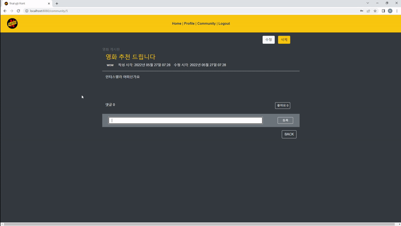
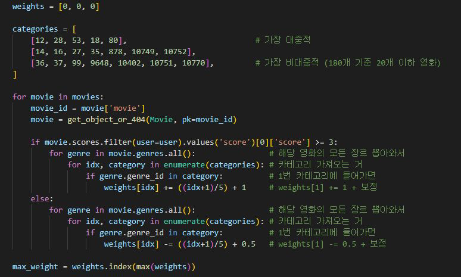
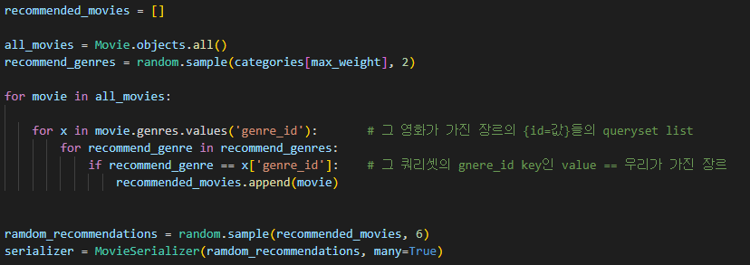

# final 관통 PJT

## 1. Intro

이용자가 평가한 영화 평점 데이터를 기반으로 영화 추천을 해주는 영화 정보 커뮤니티 사이트를 만들어보았다.

**'SWEDED'**란 영화 <Be Kind, Rewind>에서 나온 말이다. 제한된 환경과 예산으로 누군가를 따라한 B급 영화들을 마치 '스웨덴에서 제작되었다(sweded)'고 말해 그럴 듯하게 내놓은 것에서 유래한다. 이 프로젝트 또한 아주 유명한 넷*릭스를 따라해 그의 sweded 버전이라고 할 수 있다.

## 2. 개발 환경

* Django 3.1.2

* vue/cli 5.0.0

* Sqlite & HTML / CSS

## 3. 팀원

* 장한나: https://github.com/hanna-debussy
* 안현모: https://github.com/coolihans

## 4. Project Overview

### 4-0. Login

* 로그인을 해야 home 과 community, 그리고 당연히 profile에 접근을 할 수 있다.

### 4-1. Home

- home 화면에는 요즘 뜨는 신작들 list 와 평점이 높은 작품들 두 가지의 추천 목록을 제공하였다. 
- 여타 ott 어플들과 같이 포스터에 커서를 올리면 영화의 제목과 함께 포스터가 hover를 하도록 나타냈다.

### 4-2. MovieDetail

MovieDetailView.vue에 들어오면 이러한 모습이다.

* TMDB가 제공하는 다양한 정보들을 노출시켰다.

* 평점을 남길 수 있다

  * 

    보이는 것과 같이 평점은 데이터를 갱신하는 순간 바인딩 된 곳도 갱신된다.

  * 영화 정보 하단에는 이 유저가 평가한 영화들에 매겨진 평점에 따라 추천 영화가 뜬다.

  

### 4-3. Profile

- profile 에서는 유저가 쓴 게시글의 목록 그리고 유저가 평가한 영화의 목록이 포스터의 형태로 나타나게 된다.
- 총 게시물과 평가한 영화의 갯수도 나타나며 포스터를 통해 영화 상세페이지로 이동이 가능하다.

### 4-4. Community

CommunityView.vue에 들어오면 이러한 모습이다.

* 게시글 목록에는 제목, 댓글 개수, 글쓴이, 작성일, 좋아요가 적혀있다.

* 게시글 작성이 가능하고, 게시글의 작성자만 수정과 삭제가 가능하다.

  * 

  * 게시글에 들어가면 댓글을 달 수 있고, 댓글 작성자만 수정 및 삭제가 가능하다.

    

  * 좋아요를 누를 수 있다.

## 5. 추천 알고리즘

- 19가지의 총 장르를 대중성의 기준으로 3 그룹으로 나눴다.
- 가장 해당되는 영화가 많은 장르를 대중적이라고 했기 때문에 1그룹은 평균적으로 30~40개, 하위인 3그룹은 해당되는 영화가 10개 언저리였다.
- 유저의 평점을 기반으로 각 카테고리에 가중치를 두어 가장 선호하는 카테고리가 어떤 그룹인지 판단을 했다.
- 3점 이상의 평점을 주었을 경우 `+` , 그 반대의 경우 `-` 의 값이 해당 카테고리에 주어진다.

* 가장 선호하는 카테고리에 해당하는 영화를 추천영화 목록에 넣은 후 6개를 랜덤으로 추출해 유저 개인에게 노출시켰다.

## 6. 후기

* 장한나

back과 front 간의 소통과 이해가 중요하다는 걸 알았다. 두 개가 완전히 나누어질 수 없는 부분이 있어 그 부분을 서로 이해시키고 이해하는 시간이 유익했던 것 같다. 같이 프로젝트를 진행하는 것이 혼자 하는 것보다 어쩌면 더 많이 배울 수 있는 기회처럼 느껴졌다

* 안현모

2인 이상의 프로젝트를 진행하게 될 경우 닥치게 될 어려움이 눈 앞에 절로 그려졌다. 하지만 이번 기회를 통해 어떻게 헤쳐나가야 할지 조금은 알게 된 기분이다. 페어로 진행하면서 서로의 코딩 작성을 볼 수 있어 많이 배울 수 있었다. 다음에는 이번에 넣지 못한 기능들을 넣어보고 싶다.
